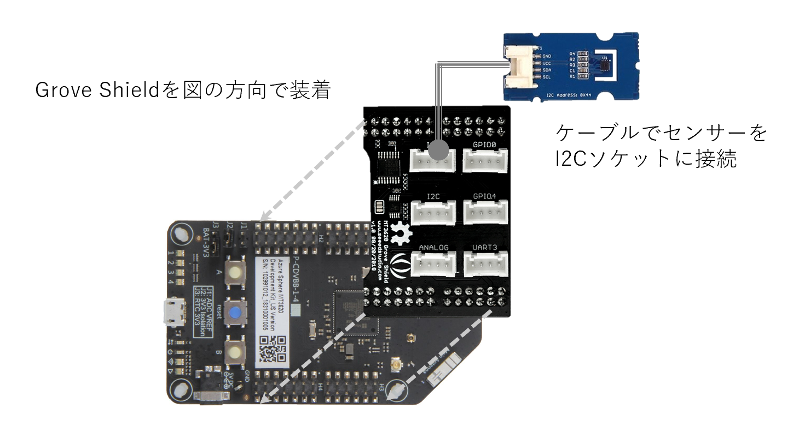
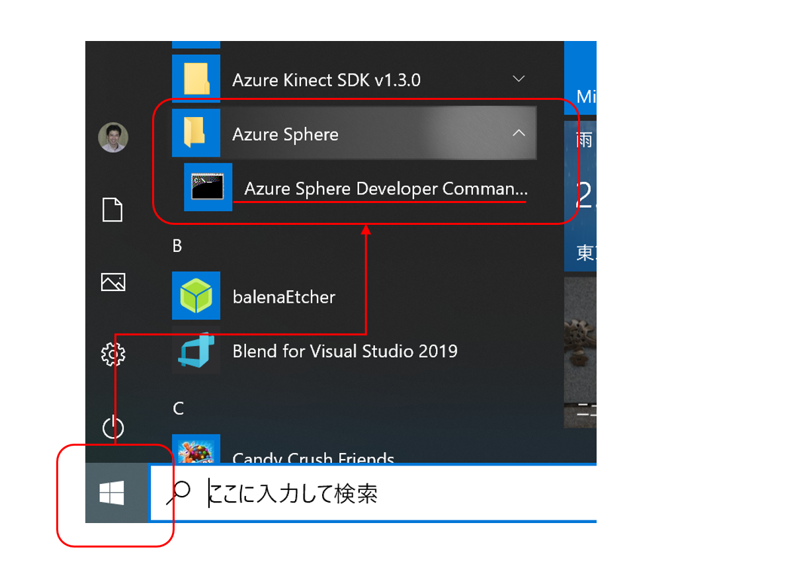
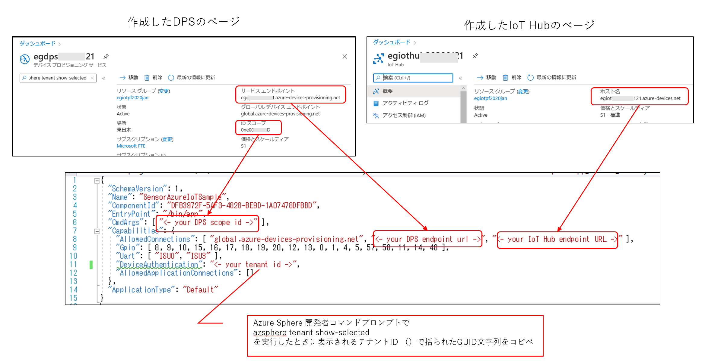
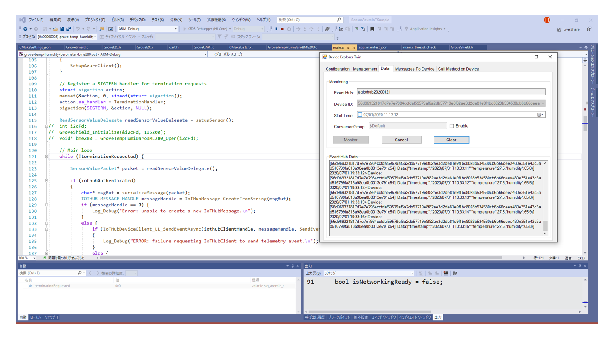

# Azure Sphere - Azure IoT Hub へのテレメトリーデータ送信サンプル  
このサンプルは、[Azure Shpere Grove Starter Kit](https://wiki.seeedstudio.com/Grove_Starter_Kit_for_Azure_Sphere_MT3620_Development_Kit/) を使って、センサー情報を Azure IoT Hub に送信するサンプルです。  
本サンプルは、Seeed社が公開している [https://github.com/Seeed-Studio/MT3620_Grove_Shield](https://github.com/Seeed-Studio/MT3620_Grove_Shield)と、マイクロソフトが公開している[https://github.com/Azure/azure-sphere-samples/tree/master/Samples/AzureIoT](https://github.com/Azure/azure-sphere-samples/tree/master/Samples/AzureIoT) を組み合わせて作成しています。 

※重要  
このサンプルを動かすには、Azure Sphere MT3620 開発ボードと、適切に設定された、Azure IoT Hub、Device Provisioning Service が必要です。設定手順は、以下の説明を参考にしてください。  

このサンプルは以下を実行します。

- Grove Starter Kit のSHT31センサーがある場合は、温度と湿度を定期的に Azure IoT Hub に送信します。 
- BME280センサーがある場合は、温度と湿度、気圧を定期帝に Azure IoT Hub に送信します。
- どちらのセンサーも無い場合は、シミュレートされた温度が定期的に Azure IoT Hub に送信されます。 

# 前提条件  
このサンプルを実行するには、以下のものが必要です。  
- Azure Sphere SDK 20.04以上
- Azure Subscription - サブスクリプションがない場合は、[無料お試し版](https://azure.microsoft.com/ja-jp/free/?v=17.15)でも構いません。 

# 準備 
## ハードウェアの組み立て  
図に従ってシールドやセンサーの装着を行ってください。
  
※ Grove Starter Kit は必須ではありません。

## Azure Sphere、開発環境の準備  
1. Azure Sphere デバイスと開発環境のセットアップ 
2. この[リポジトリ](https://github.com/ms-iotkithol-jp/MT3620_Grove_Shield)を、各自の開発PCに clone もしくは ZIP ファイルでダウンロード＆解凍し、Samples/SensorAzureIoTSample フォルダーに移動
3. Azure Sphere ボードを開発PCに USB で接続
4. Visual Studio 2019 で、Samples/SensorAzureIoTSample フォルダーを開く  

## Azure IoT Hub の作成 
Azure Portal をブラウザで開き、各自のAzure Subscription でサインします。  
[「IoT Hubの作成」](https://docs.microsoft.com/ja-jp/azure/iot-hub/iot-hub-create-through-portal#create-an-iot-hub)に記載された説明に従って、Azure IoT Hub を作成します。  
※ Azure IoT Hubの名前はインターネット上に公開されるエンドポイントのURLとして使われるので、既に他の誰かが使っている名前は指定できません。

---
## DPS の作成  
[「新しい IoT Hub Device Provisioning Service を作成する」](https://docs.microsoft.com/ja-jp/azure/iot-dps/quick-setup-auto-provision#create-a-new-iot-hub-device-provisioning-service)に記載された説明に従って、Device Provisioning Service を作成します。

---
## Azure Sphere 用に Azure IoT Hub を設定  
[「Azure Sphere 用の Azure IoT Hub を設定する」](https://docs.microsoft.com/ja-jp/azure-sphere/app-development/setup-iot-hub)に記載された説明を熟読し、記載された内容を漏れなく慎重に設定作業を行ってください。  

※注意  
- 手順２. の 1．「Azure Sphere の [スタート] メニューで利用できる Azure Sphere 開発者コマンド プロンプトを開きます。」は、Windowsボタンをクリックして、Azure Sphereフォルダーアイコンを探し開くとあります。 
  
- 手順に記載された、azsphere から始まるグレーがかけられたコマンドは、全て、Azure Sphere 開発者コマンドプロンプト上で実行します。
- Azure Shpere 開発者コマンドプロンプトでコマンド実行を行うときに、loginを忘れないようにしてください。

この一連の設定の中で、DPSのURL、ScopeId、IoT HubのURL、テナントIDを使って、各自のサンプルコードのapp_manifest.jsonを編集します。  

---
## app_manifest.json の編集  
以上の手順で確定した、各自の DPS や IoT Hub 設定情報を使って app_manifest.json を編集し、各自のサンプルを、作成した DPS、IoT Hub に接続可能にします。 
1. SensorAzureIoTSample フォルダーを開いている Visual Studio 2019 で、app_mainifest.json を開きます。
2. <- ->で示された部分を、各自の値で置き換えます。
 - <- your DPS scope id -> ← DPS のスコープID
 - <- your DPS endpoint url -> ← DPS のサービスエンドポイント
 - <- your IoT Hub endpoint URL -> ← IoT Hub のホスト名
 - <- your tenant id -> ← 開発者コマンドプロンプトで取得したテナントID

以上で準備は完了です。Azure Sphere MT3620 Developer Kit ボードが USBで開発用PCに接続されていることをご確認ください。  

---
## サンプルの実行 
Visual Studio 2019 でフォルダーを開くと、CMakeList.txtを読み込み、庫のフォルダーが、CMake対応のプロジェクトであることを自動判別します。しばらくすると、構成コンボボックスの表示が ARM-Debug に代わります。  
スタートアップアイテムを、GDB Debugger(HLCore) に変更し、クリックするとビルド、Azure Sphere へのアプリ転送、実行が開始されます。 

※ IoT Hub に送信したテレメトリーデータは、Device Explorer でモニターできます。インストールは[こちら](https://github.com/Azure/azure-iot-sdks/releases/download/2016-11-17/SetupDeviceExplorer.msi)からできます。
